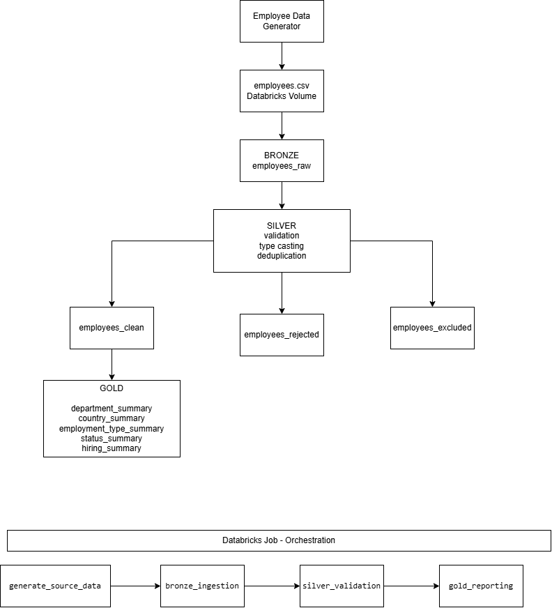

# People Data Pipeline

End-to-end data engineering project built in Databricks using PySpark, SQL and Delta Lake.

The pipeline generates synthetic employee data, loads raw data into the Bronze layer, validates and cleans it in Silver, and creates reporting tables in Gold.

## Medallion architecture.

Source Data
- Bronze
- Silver
- Gold

## Pipeline Flow

1. Generate synthetic employee data with intentional data quality issues.
2. Load the raw CSV file into the Bronze layer.
3. Validate, clean and deduplicate the data in the Silver layer.
4. Split records into clean, rejected and excluded datasets.
5. Create reporting tables in the Gold layer.
6. Run the full process using a Databricks Job.

## Tech Stack

- Databricks
- PySpark
- SQL
- Delta Lake
- Python
- Git / GitHub

## Data Quality Checks

The Silver layer checks for:

- invalid salary values
- invalid employee status
- missing country
- missing or invalid email
- missing or invalid hire date
- duplicate employee IDs

## Silver Outputs

The validated data is split into three Delta tables:

- `employees_clean` - valid records used for reporting
- `employees_rejected` - records with data quality issues
- `employees_excluded` - older duplicate records

## Gold

The Gold layer creates business-ready summary tables:

- `department_summary` - employee count and average salary by department
- `country_summary` - employee count and average salary by country
- `employment_type_summary` - employee count and average salary by employment type
- `status_summary` - employee count and percentage by status
- `hiring_summary` - employee count by hire year

## Orchestration

The full pipeline is orchestrated using a Databricks Job with the following task flow:

generate_source_data - bronze_ingestion - silver_validation - gold_reporting
